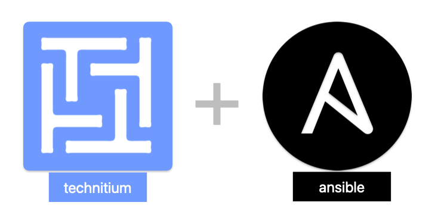

In this article, we are going to set up Technitium using Ansible and also maintain the DNS records by using Technitium Api.

You could read all the details in [this medium article](https://github.com/azolf/Technitium-DNS-Server-Setup-And-Maintain-Records-Using-Ansible).

